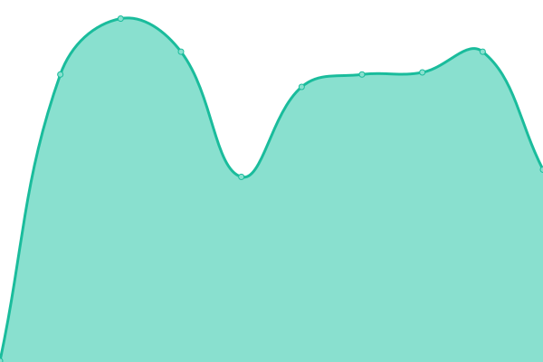
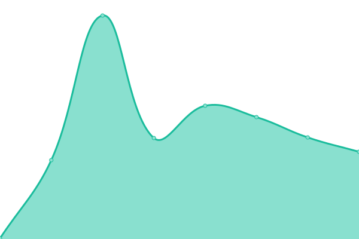
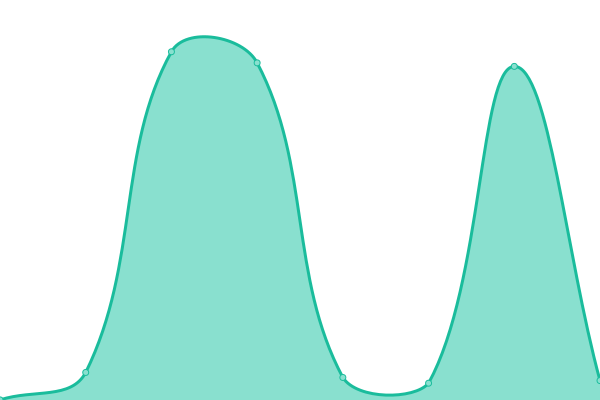
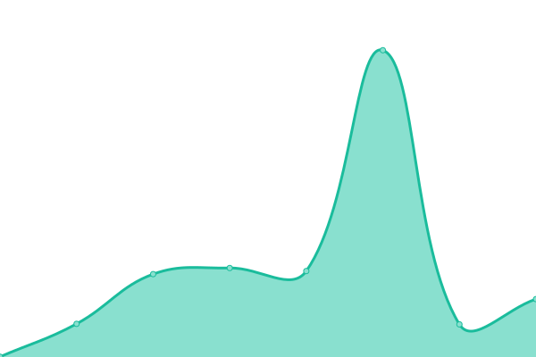

# [📈 Live Status](https://status.energyworldnet.com): <!--live status--> **🟩 All systems operational**

This repository contains the open-source uptime monitor and status page for [Energy Worldnet](https://www.energyworldnet.com), powered by [Upptime](https://github.com/upptime/upptime).

With [Upptime](https://upptime.js.org), you can get your own unlimited and free uptime monitor and status page, powered entirely by a GitHub repository. We use [Issues](https://github.com/energyworldnet/status/issues) as incident reports, [Actions](https://github.com/energyworldnet/status/actions) as uptime monitors, and [Pages](https://status.energyworldnet.com) for the status page.

<!--start: status pages-->
<!-- This summary is generated by Upptime (https://github.com/upptime/upptime) -->
<!-- Do not edit this manually, your changes will be overwritten -->
<!-- prettier-ignore -->
| URL | Status | History | Response Time | Uptime |
| --- | ------ | ------- | ------------- | ------ |
|  [Landing Page](https://www.energyworldnet.com) | 🟩 Up | [landing-page.yml](https://github.com/energyworldnet/status/commits/HEAD/history/landing-page.yml) | 

 327ms
     
 | 

<a href="https://status.ewn.com/history/landing-page">100.00%</a>
    

|  [Login](https://auth.energyworldnet.com/static/login) | 🟩 Up | [login.yml](https://github.com/energyworldnet/status/commits/HEAD/history/login.yml) | 

 218ms
     
 | 

<a href="https://status.ewn.com/history/login">100.00%</a>
    

|  [Web App](https://app.ewn.com/legacy/Login) | 🟩 Up | [web-app.yml](https://github.com/energyworldnet/status/commits/HEAD/history/web-app.yml) | 

 650ms
     
 | 

<a href="https://status.ewn.com/history/web-app">100.00%</a>
    

|  [Testing Center](https://test-center.energyworldnet.com/Complete) | 🟩 Up | [testing-center.yml](https://github.com/energyworldnet/status/commits/HEAD/history/testing-center.yml) | 

 2254ms
     
 | 

<a href="https://status.ewn.com/history/testing-center">100.00%</a>
    

|  [SCORM & AICC Content](https://scorm.ewn.com/defaultui/version.aspx) | 🟩 Up | [scorm-and-aicc-content.yml](https://github.com/energyworldnet/status/commits/HEAD/history/scorm-and-aicc-content.yml) | 

 297ms
     
 | 

<a href="https://status.ewn.com/history/scorm-and-aicc-content">100.00%</a>
    

<!--end: status pages-->

[**Visit our status website →**](https://status.energyworldnet.com)

## 📄 License

- Powered by: [Upptime](https://github.com/upptime/upptime)
- Code: [MIT](./LICENSE) © [Energy Worldnet](https://www.energyworldnet.com)
- Data in the `./history` directory: [Open Database License](https://opendatacommons.org/licenses/odbl/1-0/)
